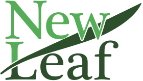

    

# New Leaf Banking App

A banking app add-on to help users budget. 

  

## **About**

New Leaf Bank’s budgeting app was created during a 4-day hackathon in August of 2023, by UX Designers, [Sierra Coleman](https://www.linkedin.com/in/slaurencoleman/) and [Darran Moore](https://www.linkedin.com/in/darranmoore/), and Software Engineers, [Vilem McKael](https://www.linkedin.com/in/vilem-mckael/), [Fredy Laksmono](https://www.linkedin.com/in/fredy-laksmono/), [Dustin Portell](https://www.linkedin.com/in/dustinjs/), and [Yuta Okkotsu](https://www.linkedin.com/in/yutaokkotsu/). 

## **Purpose**

This app is dedicated to helping the way you manage your finances. The app is designed to simplify the complexities of budgeting and expense tracking, by integrating budgeting features with New Leaf Bank's App. 

The visuals help to intuitively manage your budget, ensuring that your spending aligns with your goals and empowers you to make informed decisions.

## **Visual Mockups**

## **Github**

This repo contains the code for the front end. For the [back end, click here.](https://github.com/The-Third-Team/React-FinancialApp-BackEnd)

## **Next Steps**

- Allow connectivity with banking institution's API for real-time and accurate transaction records

## **Installation Options**
1. Fork and clone this repo.
2. % npm install
3. Follow installation instructions for the [back end, here.](https://github.com/The-Third-Team/React-FinancialApp-BackEnd)

## **Motivation**

Our team, initially comprised of nine individuals spanning Data Science, UX, and Software Engineering fields, started with a vision to craft a user-friendly app that empowers individuals in managing their finances with unparalleled ease. 

As our team size fluctuated, so did our determination adapting like the leaves that sway but never break. With every transition, we embraced the metaphor of turning over a new leaf – shedding the old, embracing the new to create this app.

## **Team**

**UX Team:**

[Sierra Coleman](https://www.linkedin.com/in/slaurencoleman/) : [portfolio](https://www.createherlauren.com)

[Darran Moore](https://www.linkedin.com/in/darranmoore/) : [portfolio](https://www.darranmoore.com)

**Software Engineering Team:**

[Vilem McKael](https://www.linkedin.com/in/vilem-mckael/) : [portfolio](https://vilemmckael.netlify.app) : [github](https://github.com/Vilem-McKael)

[Fredy Laksmono](https://www.linkedin.com/in/fredy-laksmono/) : [portfolio](http://www.flaksmono.com) : [github](https://github.com/fredy-laksmono)

[Dustin Greyfield](https://www.linkedin.com/in/dustinjs/) : [portfolio](https://www.dustinjs.dev) : [github](https://github.com/Scynes) 

[Yuta Okkotsu](https://www.linkedin.com/in/yutaokkotsu/) : [portfolio](https://www.yutaokkotsu.com)  : [github](https://github.com/yutaokkots)

### **Acknowledgements**

Thank you to our former members: Ian Abbene, May Khaing, Argo (Argishti) Ovsepyan, Gizeli Pereira, and Robin Stopa,

and organizers, Cathlyn Stahl & Fernando Rodriguez.